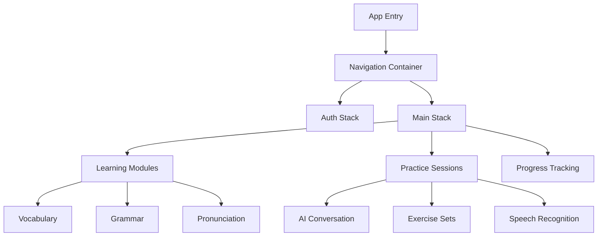
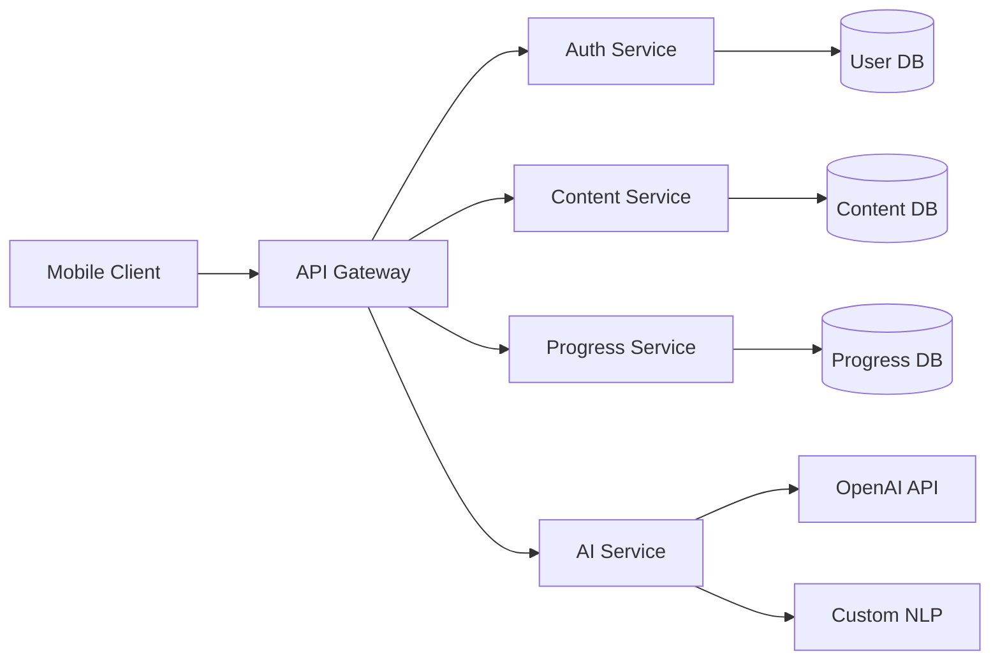
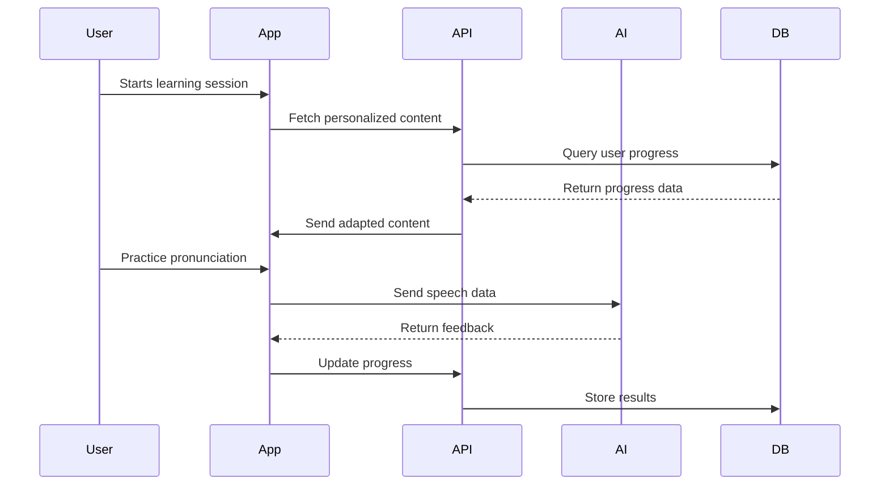

# Language Learning Application Architecture

## Overview

This document outlines the architecture of our multilingual language learning mobile application, supporting Chinese, English, and German language acquisition across different proficiency levels (A1-C2).

## Technology Stack

### Frontend (React Native)



#### Core Components
- **React Native** (v0.72+)
- **TypeScript** for type safety
- **React Navigation** for routing
- **Redux Toolkit** for state management
- **React Query** for data fetching

#### UI/UX Components
- **React Native Paper** for Material Design
- **React Native Vector Icons**
- **React Native Reanimated** for animations
- **React Native Gesture Handler**

#### Language-Specific Components
- **React Native Voice** for speech recognition
- **React Native Localization**
- **Custom Unicode handling for CJK characters**

### Backend Services



#### API Layer
- **Node.js** with Express
- **GraphQL** for flexible data querying
- **JWT** for authentication
- **WebSocket** for real-time features

#### Databases
- **MongoDB**
  - User profiles
  - Learning content
  - Progress tracking
- **Redis**
  - Session management
  - Caching
  - Real-time features

#### AI/ML Services
- **TensorFlow Lite** (on-device)
- **OpenAI API** integration
- **Custom NLP models** per language

## Key Features

### 1. Learning Path System
- Adaptive difficulty based on user performance
- Personalized content selection
- Progress tracking and analytics

### 2. Pronunciation Training
- Real-time feedback
- Speech recognition
- Accent analysis
- Pronunciation scoring

### 3. Grammar and Vocabulary
- Contextual learning
- Spaced repetition
- Interactive exercises
- Visual learning aids

### 4. AI Conversation Practice
- Context-aware dialogues
- Real-time corrections
- Cultural context integration
- Difficulty adaptation

## Data Flow



## Security Considerations

### Authentication
- JWT-based authentication
- Biometric authentication option
- Secure token storage
- Regular token rotation

### Data Protection
- End-to-end encryption for user data
- GDPR compliance
- Local data encryption
- Secure API communication

## Offline Capabilities

### Local Storage
- AsyncStorage for user data
- SQLite for learning content
- Offline progress tracking
- Content pre-downloading

### Sync Mechanism
- Background sync
- Conflict resolution
- Delta updates
- Bandwidth optimization

## Performance Optimization

### Mobile-Specific
- Lazy loading of heavy content
- Image optimization
- Memory management
- Battery usage optimization

### Network
- Request batching
- Cache management
- Compression
- CDN utilization

## Development Workflow

### Environment Setup
```bash
# Install dependencies
npm install

# Start Metro bundler
npx react-native start

# Run on iOS
npx react-native run-ios

# Run on Android
npx react-native run-android
```

### Testing Strategy
- Jest for unit testing
- Detox for E2E testing
- Manual testing checklist
- Performance testing

### CI/CD Pipeline
- GitHub Actions
- Automated testing
- Code quality checks
- Deployment automation

## Monitoring and Analytics

### Performance Monitoring
- React Native Performance
- Custom metrics tracking
- Error reporting
- Usage analytics

### User Analytics
- Learning patterns
- Feature usage
- Error patterns
- User engagement

## Future Considerations

### Scalability
- Microservices architecture
- Load balancing
- Database sharding
- Caching strategies

### Feature Expansion
- VR/AR integration
- Social learning features
- Additional languages
- Advanced AI features
